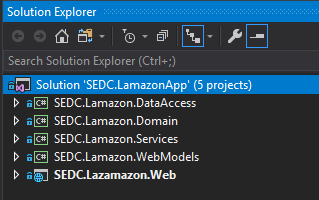
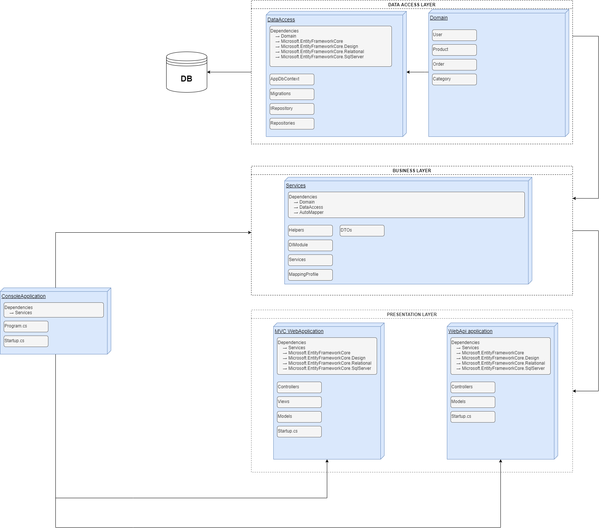
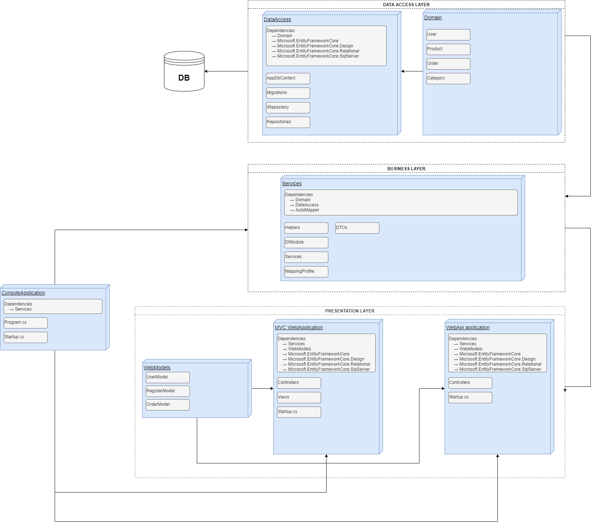

# Lamazon Application
## From brainstorming to e2e solution 🚀
### 

## Brainstorming 🧠
**Brainstorming** is the first part when we talk about some software implementation. This is the part where we put our ideas on a piece of paper, and then in the process of planning and implementation we somehow, magically, turn them into a real software solution (final product). 
That is exactly what we did in the first lecture of the Practical ASP.NET course. 

## Planning 🗓️
Further we discussed about all the business entities that we need so that we can develop an application that will serve as an online store where the users that will use our app can register their account, log in, search for products, put them in their cart and finally buy them. 

So we can say that this is the part where we plan which entities we will need, how will they be connected with each other and which properties will they need. 

## Architecture 📐
After we got some initial perception for our entities, which are maybe one of the most important parts of our app, we discussed about the architecture that our software will have, so that it will be more secure and will keep things separated and decoupled. By doing that, our code can be easily maintainable and there will be a separation of concerns.

As we agreed, we started building our software solution by using **N-Tier architecture**. 

So for that purpose we created a new project in Visual Studio, and inside the solution we created five separate projects (class libraries).

## Hands on coding! ⚙️

### SEDC.Lamazon.Domain
After we created the 5 projects (like on the picture above), we started implementing our models first. 
So we created our Domain models, that further in the process of development we want to translate in our database tables, as well as the enums that we need.

### SEDC.Lamazon.DataAccess
After we finished our models we moved to implementation of our DataAccess project, where the magic happens. In the DataAccess layer we separate the structure into multiple folders, like for example Interfaces and Repositories. In the interface folder we add the IRepository interface and the IUserRepository. In the Repositories folder we add all the repositories that we need for our models - OrderRepository, UserRepository and so on. 

**It is important to notice that our Repositories implement the interfaces. Basically they are their implementation in which we take care of all the CRUD operations for our models.**

** **Here we also add a BaseRepository in which we only inject an instance of our DbContext class, that's why all our repositories inherit from BaseRepository class, so that in every repository we will have reference to our DbContext class, which is a reference to our database.** **

Further in the DataAccess layer we implement the LamazonDbContext class that we need, so that by using EntityFramework we can translate our domain models into a database tables. This LamazonDbContextClass inherits from DbContext class which enables our LamazonDbContext become the context from the database of the application.

Here we also override the OnModelCreating() method and specify all the relations between our entities. In other words we tell the EntityFramework how to configure the database we want. Also we seed some data in the same method. This way of specifying relations between our entities is called a fluent API specification.

**(Read about the services implementation before this paragraph to get knowledge of how to specify the connection to the database -> DIModule!!!)**  
After all of this, we open the NugetPackageManager Console, select the SEDC.Lamazon.DataAccess project as a Default one, and type the two already known commands. 
* `Add-Migration Initial`(or whatever name would you prefer)
* `Update-Database`

### SEDC.Lamazon.Services
This project is where all the business logic is located. Here we also separate the structure in three folders. Helpers, Interfaces and Services folder. In the services folder we implement all the services for every entity with all the methods 

* #### Helpers
In this folder we create our helper classes. They are DIModule.cs and MappingProfile.cs

1. DIModule.cs - In this class we add one static method that will return IServiceCollection with two input parameters as it is shown further and it is called RegisterModule(IServiceCollection services, string connectionString). 

2. MappingProfile.cs - In this class we configure AutoMapper, which we use so that we can map our domain models into a ViewModels. In order to do this we need to install the appropriate NuGet Packages first which are the following: 

* In services: AutoMapper v7.01
* In WebApplication: AutoMapper.DependencyInjection v5.0.1
* Add in Startup.cs services.AddAutoMapper();

As the N-tier architecture requires, we don't want reference from DataAccess layer to our Presentation layer (or the Application layer). Since we have to register our Repositories and Services in Startup.cs which is located in the Application layer we must reference DataAccess project with the Application project (Which we don't want by any chance!!!).

So the purpose of this helper class is to make a "ring road" so instead of referencing the DataAccess and Application, we reference the DataAccess with the Services layer (which is OK!). In the RegisterModule method we don't do nothing special, only registering the DbContext and our Repositories and Services, just as we did on MVC course, but directly in the Startup.cs Then we call this method in the Startup.cs class, and again the same goal is achieved, just according to the N-tier architecture rules. 

After we register this in our Startup.cs class, then we start with the migrations and database thing.**(Go back to the last paragraph of the previous section).**

* #### Interfaces
In this folder we have the interfaces as an abstraction to our services.

* #### Services 
In this folder we have the actual Service classes with implementation of all the CRUD methods that communicate with the appropriate repositories so that we can store in or read from the database.

### SEDC.Lamazon.WebModels
In this project we create the ViewModels, the models that we send to the Views, and that are used for data binding when trying to register a user, or login and so on. We add here the appropriate enums as well. 

### SEDC.Lamazon.Web

* #### Controllers

Finally we come to the main point, the MVC application itself, or the Application layer. Here we think of all the entities that we need to create a separate controllers for. So we create the controllers and their appropriate actions. For the purposes of our application we created four custom controllers, plus the one that is created with the starting template of an MVC application. The five controllers were:

1. HomeController
2. UsersController
3. OrderController
4. ProductController
5. InvoiceController

* #### Views
In the Views folder we added the appropriate views so that we can display the data to the user, create new orders, register users and so on.

### N-Tier Architecture visual representation
This readme is like a quick guide for how the Lamazon app is structured and implemented, so until now you have already a knowledge in how this app uses n-tier architecture and you have a perception of how you need to implement it. 

If we put all of the code implementation along with the projects from the solution into one image, it will look like on the following image. This is so that you can get better view of the whole implementation through one picture.

* ##### If you decide to use models as part of your MVC or WebApi application

* ##### If you decide to introduce another project in the solution for the web models so that the the MVC and the WebApi applications can use and share the same WebModels(View models)

