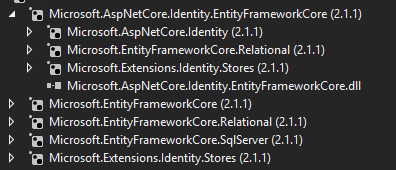
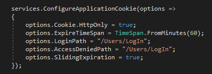
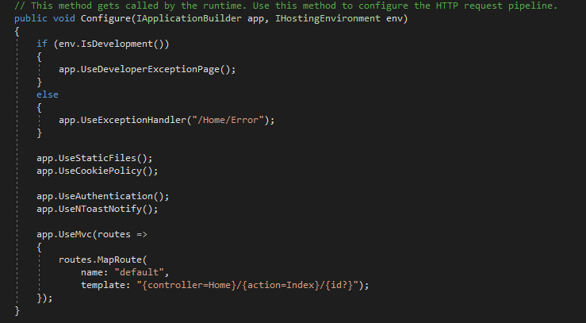
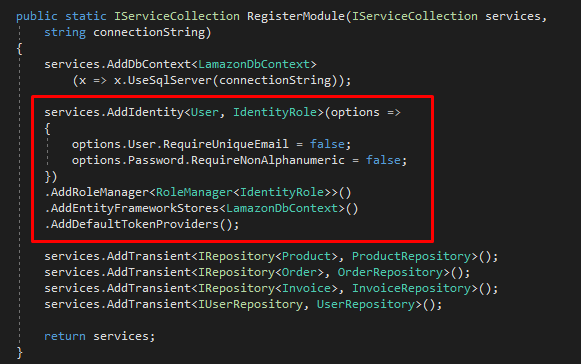

# Lamazon Application
## Configure Microsoft IdentityManager 🚀
### 

## What is Microsoft IdentityManager (MIM)?
Identity Manager is a state-based identity management software product, designed to manage users' digital identities, credentials and groupings throughout the lifecycle of their membership of an enterprise computer system. We use the MIM, so that we can easy ourselves when implementing the user manipulation, authorization, registration, sign in or sign out logic. 

## What needs to be done to use it?
In order to use the IdentityManager which is a NuGet package developed by Microsoft, we need first to install it. The packages that we need to install are:

After installing the necessary packages we go further with the configuration. First of all it is important to notice that the Identity package, after configuring it and adding the migrations will create a several tables in the database for us. This means that if we choose the use the IdentityUser class, provided by the Identity package, the Users table that we need to store the users, will be automatically created and it will have its own properties. 

But the most important thing is that we are allowed to create our own User class that will inherits from the IdentityUser class and will still have the parents class properties, but we can add some more that are important for our business logic and our application reqirements. 

## Steb-by-Step 🚪 

1. Create a User domain model, add its own properties that you need and make that class inherits from IdentityUser class which is part of the **MicrosoftAspNet.Identity** namespace. 

2. Create the ApplicationDbContext class and make that class inherits from IdentityDbContext<User>. This is a generic class that accepts your custom User class. Here you specify that you want to use the IdentityDbContext, but instead of using the default IdentityUser class provided from the IdentityManager, we specify our custom User class in the parentheses <>.

3. In the Startup.cs class, we add the following lines:

Here we configure our ApplicationCookie, we specify where the user should be redirected to when it will try to access URL that request to be authorized (loged in) so that you can access it. We also set the expiration time of the cookie and so on.

A few lines below this, in the Configure method of the Startup.cs class we add the middleware app.UseAuthentication(), but important to notice is that we add this line before app.UseMvc().

4. Back to the Helpers folder of the SEDC.Lamazon.Services project, we add the following lines in the DIModule.cs class in the RegisterModule method.

Here we configure all the needed things for the identity as intended. We specify whether we want the users to have unique emails, or whether the password should require non alpha numeric characters and so on. We also use AddRoleManager which adds the RoleManager that will manage the user roles and so on. 

After all of this we add a migration and update our database. If everything is configured properly, into the database we should get tables like: AspNetUsers, AspNetRoles, AspNetUserRoles etc. These are the tables created by the IdentityManager package, and the table that we need to store the newly registered users is the AspNetUsers table. If everything works fine, you should have the default columns in the AspNetUsers like EmailConfirmed, PasswordHash, SecurityStamp and many more, but also you should have the custom columns that you added as a properties to your User class. 

We can say that this is one of the many ways how we can implement Identity in our application so we can easily manage the user registration, authorization and authentication. There are also more complex ways of how to implement it. If you want you can read more on the following microsoft documentation link:

#### --> [Setup Identity in your MVC application](https://docs.microsoft.com/en-us/aspnet/core/security/authentication/identity?view=aspnetcore-3.0&tabs=visual-studio) :zap: